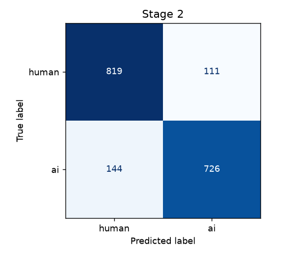

# AI-Generated Text Detection — Project Report

**Subject:** AIML | **Deliverable:** working system + evaluation
**Spec:** [`SRS_AI_Text_Detection (1).md`](SRS_AI_Text_Detection%20(1).md)

---

## 1. Problem

Given a piece of English text, decide whether it is:

- **human-written**,
- **raw AI-generated** (straight LLM output), or
- **humanized AI** — LLM output that has been paraphrased to evade detection.

Constraint from the SRS: **classical ML only** for anything we train. A
pre-trained GPT-2 is allowed for *scoring* (perplexity), not for classification.

---

## 2. Approach — a two-stage cascade + always-on evidence

```
                    ┌───── always runs (FR-17) ─────┐
  input text ──┬───▶│  rule-based style checker      │
               │    │  GPT-2 perplexity / burstiness │
               │    └───────────────────────────────┘
               │
               ▼
        Stage 1  (raw AI vs human)         model_raw.pkl
        │  P(AI) ≥ 0.85  ─────────────▶  final = "AI (raw)"      (FR-18)
        │  otherwise
        ▼
        Stage 2  (humanized AI vs human)   model_humanized.pkl
        │  P(AI) ≥ 0.5   ─────────────▶  final = "AI (humanized)" (FR-19)
        └  else          ─────────────▶  final = "Human"
```

Both stage models are **TF-IDF → Logistic Regression**. Each vectoriser is a
union of

- **word** 1–2 grams (vocabulary / phrasing), and
- **character** 3–5 grams (`char_wb` — punctuation habits, function-word
  morphology, spacing),

which matters most for Stage 2, where AI and human text share vocabulary and the
signal is stylistic. `C` is picked per stage by 3-fold CV ROC-AUC.

The **rule-based checker** (em-dash density, AI-cliché phrases, sentence-length
uniformity) and the **GPT-2 perplexity/burstiness** module run on every input
regardless of the cascade path and are shown as supporting evidence. The
perplexity signal is turned into a probability by a small logistic **calibrator**
fitted on real data (`aitext.calibrate_perplexity`), falling back to a
hand-tuned heuristic if the calibrator file is absent.

---

## 3. Data

| Split | Source | Notes |
|---|---|---|
| Stage 1 — human | **MAGE + HC3** (`--source both`) | MAGE: 10 domains (reddit-CMV, ELI5, TL;DR, XSum, WritingPrompts, ROCStories, HellaSwag, SQuAD, SciGen, Yelp); HC3: human Q&A answers |
| Stage 1 — raw AI | **MAGE + HC3** | MAGE: 300+ generators; HC3: ChatGPT answers |
| Stage 2 — human | *same* human pool as Stage 1 | (SRS §7.2) |
| Stage 2 — humanized AI | the Stage-1 AI texts, paraphrased | **mixed humanizer** (below) |

**Why this mix of sources:**

- **HC3 alone** (ChatGPT Q&A vs human Q&A) is *easy* — one model, one domain.
  A classifier hits ~96 %, but it has really learned "encyclopaedic / formal ⇒
  AI" and false-positives on formal human writing (SRS §9).
- **MAGE alone** is *hard* — 300+ generators, 10 domains, short and long texts.
  Classical TF-IDF tops out around 76 % on it (transformer detectors in the MAGE
  paper get ~85 % in-distribution, ~65 % out-of-distribution — this is a hard
  benchmark).
- **MAGE + HC3** keeps MAGE's domain robustness and adds HC3's clean single-model
  cases, landing in between. `--source mage` / `hc3` reproduce the extremes.

**Mixed humanizer (SRS §9 — avoid learning one tool's fingerprint):**

| Humanizer | Share | What it is |
|---|---|---|
| `t5` | ~55 % | `humarin/chatgpt_paraphraser_on_T5_base`, neural, run on GPU |
| `realpara` | ~25 % | genuine **GPT-4-paraphrased** text from MAGE's OOD para set |
| `pseudo` | ~20 % | rule-based rewrite (contractions, synonym swaps, clause shuffle) |

Ratios are configurable (`--mix`), and you can bypass all of it with
`--humanized-csv` to drop in Quillbot / Undetectable.ai output.

**Split:** every model uses a stratified **80 / 20 train/test split**
(`random_state=42`). The 20 % test rows are written to `data/*_test.csv` so the
evaluation never scores on training data.

---

## 4. Results

See [`docs/results.md`](docs/results.md) (regenerate with
`python -m aitext.report`). Headline figures and confusion matrices:

<!-- RESULTS-PLACEHOLDER: paste the summary numbers here after running report.py -->





**Reading the cascade matrix:** the `raw-ai` ↔ `humanized-ai` cell is the fuzzy
one — paraphrased text still reads as "AI", so Stage 1 often catches it first.
The metric that matters for a user ("is this AI at all?") stays high; the
raw/humanized split is secondary evidence.

---

## 5. Limitations (SRS §9)

- **Humanized detection is optimistic here.** Stage 2 partly learns the
  paraphrasers' fingerprints. A truly novel humanizer will do better against it —
  this is an industry-wide limitation, not specific to this system.
- **False positives** remain on unusually terse or non-native English.
- **English only.** No watermark verification (needs provider cooperation and
  does not survive paraphrasing).
- GPT-2 perplexity is a weak individual signal (see histogram overlap); it is
  used only as corroborating evidence.

---

## 6. Reproducing

```bash
python3 -m venv .venv && source .venv/bin/activate
pip install -r requirements.txt

python -m aitext.datasets_build --max-per-class 8000   # ~25 min (GPU paraphrasing)
python -m aitext.train                                  # ~2 min
python -m aitext.calibrate_perplexity --sample 500      # ~8 min (GPU)
python -m aitext.report                                 # figures + results.md
python -m aitext.evaluate                               # console metrics

streamlit run app.py
```

Deployment: see [`DEPLOY.md`](DEPLOY.md).
