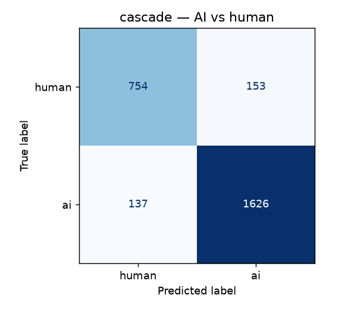
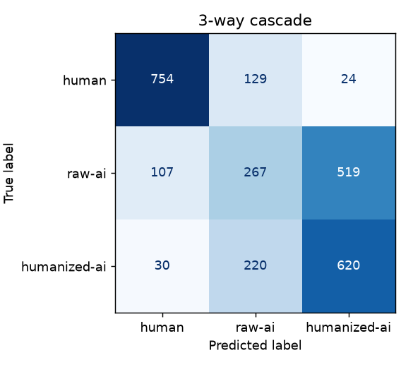
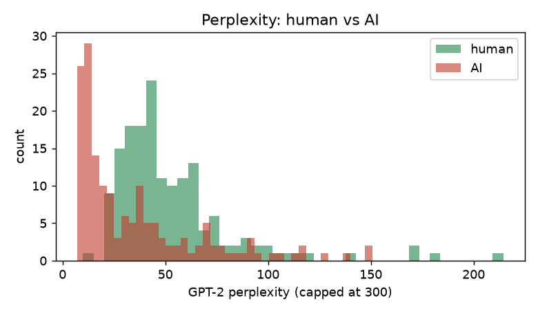

<!-- generated by `python -m aitext.report` -->
## Held-out evaluation

### Stage 1 — raw AI vs human

- Accuracy **82.0%**, ROC-AUC **0.912** (n=1800)

```
              precision    recall  f1-score   support

       human      0.811     0.838     0.824       907
          ai      0.830     0.802     0.815       893

    accuracy                          0.820      1800
   macro avg      0.820     0.820     0.820      1800
weighted avg      0.820     0.820     0.820      1800

```

### Stage 2 — humanized AI vs human

- Accuracy **85.8%**, ROC-AUC **0.941** (n=1800)

```
              precision    recall  f1-score   support

       human      0.850     0.881     0.865       930
          ai      0.867     0.834     0.851       870

    accuracy                          0.858      1800
   macro avg      0.859     0.858     0.858      1800
weighted avg      0.859     0.858     0.858      1800

```

### End-to-end cascade — binary (AI vs human)

- Accuracy **89.1%**

```
              precision    recall  f1-score   support

          ai      0.914     0.922     0.918      1763
       human      0.846     0.831     0.839       907

    accuracy                          0.891      2670
   macro avg      0.880     0.877     0.878      2670
weighted avg      0.891     0.891     0.891      2670

```



### End-to-end cascade — 3-way (human / raw-ai / humanized-ai)

- Accuracy **61.5%** — the raw-AI vs humanized-AI boundary is inherently fuzzy (both are AI text)

- Humanized-AI still flagged as AI-generated: **96.6%**

```
              precision    recall  f1-score   support

       human      0.846     0.831     0.839       907
      raw-ai      0.433     0.299     0.354       893
humanized-ai      0.533     0.713     0.610       870

    accuracy                          0.615      2670
   macro avg      0.604     0.614     0.601      2670
weighted avg      0.606     0.615     0.602      2670

```



### GPT-2 perplexity distribution



Median perplexity — human 44.5, AI 22.1.
